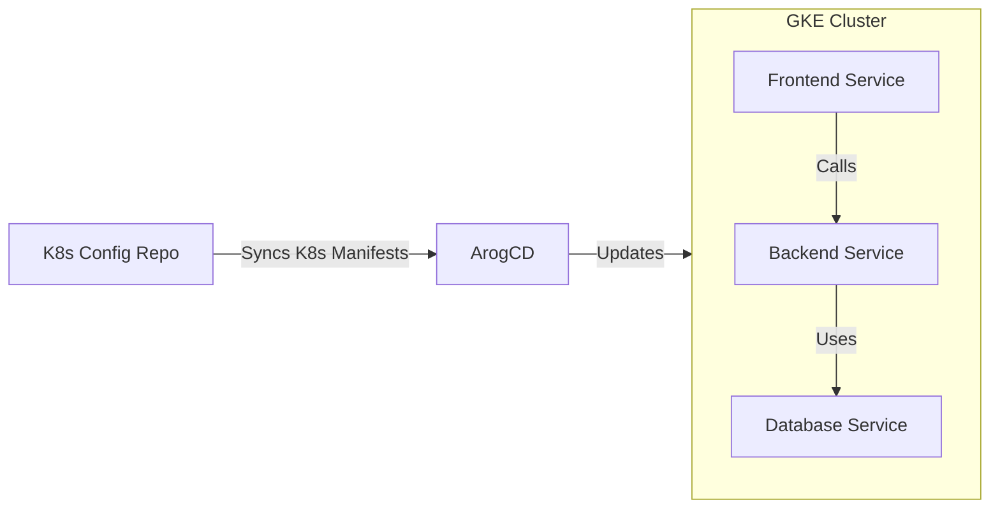

# k8s-config

This repository contains Kubernetes manifests, and ArgoCD syncs any changes from this repository into the GKE Cluster, keeping it updated. Manifests in this repo are mainted by cluster admins and ci/cd workflow of the microservices to be deployed.

## CD Flow



## ArgoCD

### Steps to Log in to ArgoCD and Sync a Repository to GKE

1. **Access ArgoCD UI**:
   - Retrieve the initial password for the `admin` user:
     ```bash
     kubectl get secrets -n argocd argocd-initial-admin-secret -o jsonpath="{.data.password}" | base64 --decode
     ```
   - Forward the ArgoCD server to your local machine:
     ```bash
     kubectl port-forward svc/argocd-server -n argocd 8080:443
     ```
   - Open the UI at `https://localhost:8080` and log in using the `admin` username and the password retrieved.

2. **Configure Git Repository in ArgoCD**:
   - In the ArgoCD UI, go to **New Application**.
   - Set the **Application Name**, **Project**, and **Sync Policy**.
   - Under **Source**, configure:
     - **Repository URL**: The URL of the Git repository.
     - **Revision**: Specify a branch or tag (e.g., `main`).
     - **Path**: The path to the manifest files (e.g., `./manifests`).
   
3. **Configure Destination (GKE Cluster)**:
   - Under **Destination**, set:
     - **Cluster URL**: Leave it as the default (`https://kubernetes.default.svc`) for the in-cluster GKE context.
     - **Namespace**: The namespace in which the resources will be deployed.

4. **Sync the Repository to GKE**:
   - Set **Sync Policy** to either **Manual** or **Automated**.
   - Click **Create** to create the application.
   - In the ArgoCD dashboard, hit **Sync** to apply the changes to GKE.

ArgoCD will now monitor your Git repository and automatically sync changes to the GKE cluster if automation is enabled.